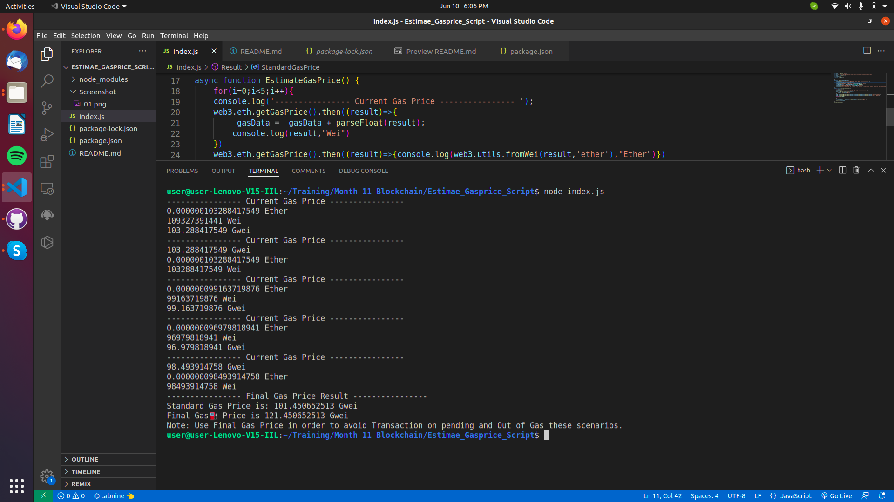
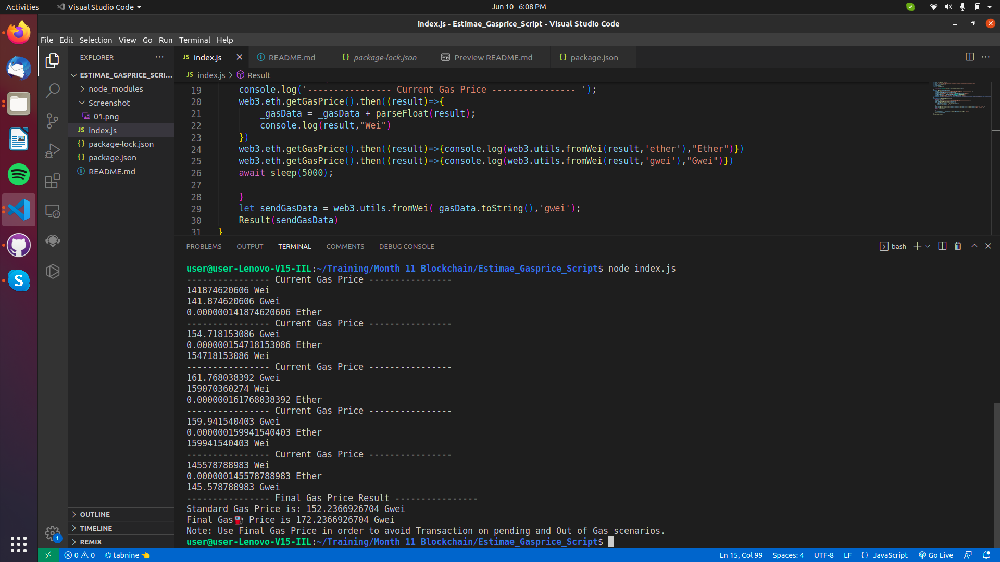

# Estimate⚖️ Gasprice⛽ Script📝

- This is a Simple script to estimate gasPrice in EVM Blockchain Network Before Making Transaction.

## Getting started 📖

📁 Create a new folder in VScode 
Open Your termial in Vscode. or press  `Ctrl+Shift+` `

🏃 Run: -- Initalize Node  
```
npm init 
```
or use ( Here `-y` means we are saying `yes` to all steps in node creation )

```
npm init -y
```

## Node Dependencies 🎒

``` 
npm install web3
```

## Steps to do 🛠️

- Create a Web3 API Provider URL.

- Ethereum  use `Infura` or `Moarils`.

- Polygon use `MagicVigil` or `Moarils` or `Infura (For Infura you can add Polygon Plugin into your account)`.

Create a `index.js` file and copy paste the following code after installing all the required dependencies.


```
var Web3 = require('web3')
var url = "Paste your Infura URL or Moarils URL or use can use any RPC API Web3 provider"
var web3 = new Web3(url)
var _gasData=0;

function sleep(ms) {
  
    return new Promise(resolve => setTimeout(resolve, ms));
}

function Result(receiveGasData){
    console.log("---------------- Final Gas Price Result ---------------- ");
    let StandardGasPrice = receiveGasData/5;
    console.log("Standard Gas Price is: "+StandardGasPrice+" Gwei");
    let FinalGasPrice = (StandardGasPrice+Number(20.0000000));
    console.log("Final Gas⛽ Price is "+FinalGasPrice+" Gwei");
    console.log("Note: Use Final Gas Price in order to avoid Transaction on pending and Out of Gas scenarios.")
}

async function EstimateGasPrice() {
    for(i=0;i<5;i++){
    console.log('---------------- Current Gas Price ---------------- ');
    web3.eth.getGasPrice().then((result)=>{
        _gasData = _gasData + parseFloat(result);
        console.log(result,"Wei")
    })
    web3.eth.getGasPrice().then((result)=>{console.log(web3.utils.fromWei(result,'ether'),"Ether")})
    web3.eth.getGasPrice().then((result)=>{console.log(web3.utils.fromWei(result,'gwei'),"Gwei")})
    await sleep(5000);
    }

    let sendGasData = web3.utils.fromWei(_gasData.toString(),'gwei');
    Result(sendGasData)

}
EstimateGasPrice()

```

## To Run ⛏️

```
 node index.js
```

## Screeshot 👀

### Tested in Ethereum Mainnet ♦️



### Tested in Polygon Mainnet ♾️
